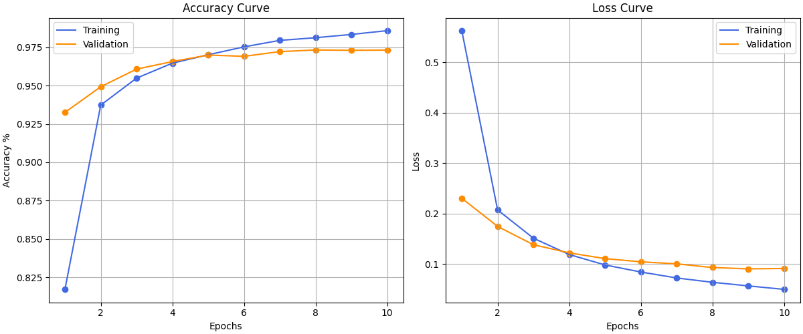

**MLP Network with NumPy to Learn MNIST**  
This project is an implementation of a multi-layer perceptron (MLP) neural network to learn the MNIST handwritten digit dataset.   
The network is trained using backpropagation with stochastic gradient descent (SGD) optimization.  

**Dataset**  
The MNIST dataset consists of 60,000 training images and 10,000 testing images of handwritten digits.    
Each image is a 28x28 grayscale image, and the goal is to correctly classify which digit the image represents.  

**Results**  

